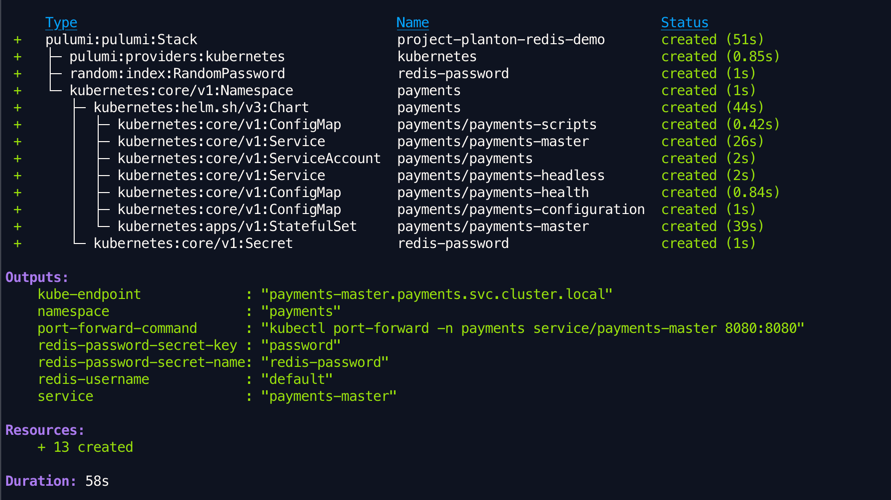

# ProjectPlanton

Simple, powerful and flexible `Multi-Cloud Deployments` framework with everything you love
from [Kubernetes Resource Model (KRM)](https://github.com/kubernetes/design-proposals-archive/blob/main/architecture/resource-management.md), [Protobuf](https://protobuf.dev/), [Buf Schema Registry](https://buf.build/product/bsr)
and [Pulumi](https://github.com/pulumi/pulumi).

**Effortlessly deploy complex infrastructure across any cloud provider using simple YAML manifests and powerful
automation.**

## Documentation

https://project-planton.org

## TL;DR

ProjectPlanton is an open-source framework that brings the simplicity of Kubernetes-like declarative configuration to
multi-cloud environments. It enables you to:

- **Multi-Cloud Unified Resource Model (MURM)**: Leverage simple, consistent [API](apis/project/planton/provider)
  written in [protobuf](https://protobuf.dev/) and published
  to [Buf Schema Registry](https://buf.build/product/bsr) to manage resources across different cloud providers. In
  short, Kubernetes like Manifests, but for Multi-Cloud. Write your infrastructure configurations in YAML manifests and
  deploy seamlessly
  across AWS, Azure, GCP, and more.

- **Automate with Pulumi Modules**: Benefit
  from [pre-written pulumi modules](module-git-repos.yaml) which takes
  [project-planton api](https://buf.build/plantoncloud/project-planton/tree/main:project/planton/provider) manifests as
  input and handle the heavy lifting of infrastructure provisioning.

- **ProjectPlanton APIs & Pulumi Modules aware CLI**: Deploy and manage your infrastructure effortlessly with a
  command-line tool that understands project-planton manifests and also knows which one of
  the [pre-written pulumi module](module-git-repos.yaml)
  to execute for the deployment.

**Get Started in 3 Easy Steps:**

1. **Install the CLI Tool**

   ```bash
   brew install plantoncloud/tap/project-planton
   ```

2. **Create a YAML Manifest**

   Example manifest
   for
   deploying [Redis On Kubernetes](https://github.com/plantoncloud/project-planton/tree/main/apis/project/planton/provider/kubernetes/rediskubernetes/v1)
   as per
   the [redis-kubernetes](https://buf.build/plantoncloud/project-planton/file/main:project/planton/provider/kubernetes/rediskubernetes/v1/spec.proto)
   deployment component

   You can create similar manifests
   for [AWS VPC](https://github.com/plantoncloud/project-planton/tree/main/apis/project/planton/provider/aws/awsvpcv1), [GKE Cluster](https://github.com/plantoncloud/project-planton/tree/main/apis/project/planton/provider/gcp/gkecluster/v1), [Kafka on Kubernetes](https://github.com/plantoncloud/project-planton/tree/main/apis/project/planton/provider/kubernetes/kafkakubernetes/v1)
   or [Kafka On ConfluentCloud](https://github.com/plantoncloud/project-planton/tree/main/apis/project/planton/provider/confluent/kafkaconfluent/v1)
   and [many more](https://github.com/plantoncloud/project-planton/tree/main/apis/project/planton/provider).

```yaml
apiVersion: kubernetes.project.planton/v1
kind: RedisKubernetes
metadata:
  name: payments
  id: payments-namespace
spec:
  container:
    replicas: 1
    resources:
      limits:
        cpu: 50m
        memory: 2Gi
      requests:
        cpu: 50m
        memory: 100Mi
    isPersistenceEnabled: true
    diskSize: 1Gi
```

3. **Deploy Your Infrastructure**

The above manifest is the input
for [redis-kubernetes-pulumi-module](https://github.com/plantoncloud/redis-kubernetes-pulumi-module). Running
`project-planton pulumi up` command will read the manifest and set it up as input for the pulumi module and also run the
pulumi module.

   ```bash
   project-planton pulumi up --manifest redis.yaml
   ```



## Contributing

We welcome contributions from the community to enhance **Project Planton**. Whether you want to fix bugs, add new
features, or improve documentation, your efforts are appreciated and will help make this project better for everyone.

### How to Contribute

1. **Fork the Repository**

   Start by forking the [Project Planton GitHub repository](https://github.com/plantoncloud/project-planton) to your own
   GitHub account.

2. **Clone the Repository**

   Clone your forked repository to your local machine:

   ```bash
   git clone https://github.com/yourusername/project-planton.git
   ```

3. **Create a Branch**

   Create a new branch for your feature or bug fix:

   ```bash
   git checkout -b feature/your-feature-name
   ```

4. **Make Changes**

    - Implement your changes, following the project's coding standards and guidelines.
    - Ensure that any new code is well-documented and adheres to the existing style.

5. **Run Tests**

    - Before committing your changes, run existing tests to ensure nothing is broken.
    - Add new tests if you're introducing new features or modifying existing functionality.

6. **Commit Changes**

   Commit your changes with clear and descriptive messages:

   ```bash
   git commit -m "Add feature X to improve Y"
   ```

7. **Push to GitHub**

   Push your branch to your forked repository:

   ```bash
   git push origin feature/your-feature-name
   ```

8. **Create a Pull Request**

    - Go to the original repository and click on "New Pull Request."
    - Select your branch and provide a detailed description of your changes.
    - Include any relevant issue numbers or context that helps reviewers understand your contribution.

9. **Review Process**

    - Your pull request will be reviewed by the maintainers.
    - Be prepared to make adjustments based on feedback.
    - Once approved, your changes will be merged into the main branch.

### Contribution Guidelines

- **Coding Standards**: Follow the established coding conventions and style guides for the project.
- **Documentation**: Update or add documentation to reflect your changes, especially in code comments and README files.
- **Commit Messages**: Write clear and concise commit messages that explain the "what" and "why" of your changes.
- **Issue Reporting**: If you encounter a bug or have a feature request, please open an issue before working on it to
  discuss the best approach.

### Code of Conduct

By participating in this project, you agree to abide by our [Code of Conduct](CODE-OF-CONDUCT.md), which outlines
expectations for respectful and collaborative behavior.

### Getting Help

If you need assistance or have questions, feel free to:

- Open an issue on GitHub.
- Join our community discussions (link to forums, Slack, Discord, etc.).
- Contact the maintainers directly via email.

## License

Project Planton is released under the [Apache 2.0 license](LICENSE). You are free to use, modify,
and distribute this software in accordance with the license terms.

## Community and Support

We encourage you to join our community and contribute to the project:

- **GitHub Issues**: Report bugs or request new features by opening an issue
  on [GitHub](https://github.com/plantoncloud/project-planton/issues).
- **Discussions**: Engage with other users and contributors in
  our [GitHub Discussions](https://github.com/plantoncloud/project-planton/discussions) forum.

## Acknowledgments

- **Brian Grant & Kubernetes API team** for their foundational work on the Kubernetes Resource Model.
- The **[Protobuf Team](https://alpha-t9kmve036m159v8u4una.sandstorm.io/)** for laying the foundation for a powerful
  language neutral contract definition language.
- The **[Buf](https://github.com/bufbuild/buf) Team** for their Protobuf tooling—including BSR Docs, BSR SDKs, and
  ProtoValidate — which collectively democratized protobuf adoption and made this project possible.
- The **[Pulumi](https://github.com/pulumi/pulumi)** team for providing a powerful infrastructure as code platform that
  enables multi-language support.
- The **[spf13/cobra](https://github.com/spf13/cobra)** team for making building command line tools a bliss.
